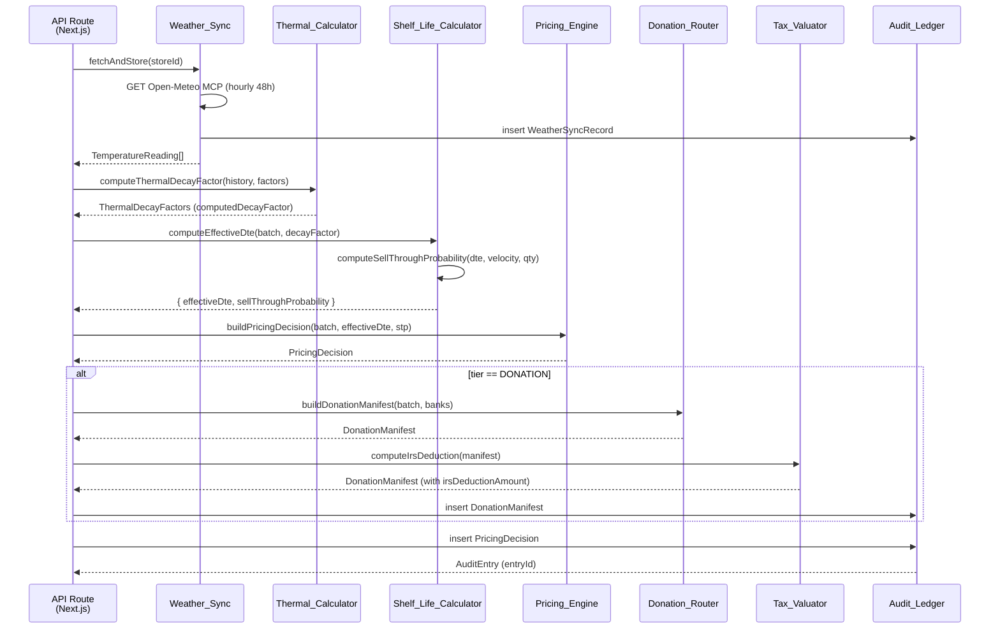

# Design Document — FreshFlow Markdown Engine

## Overview

The FreshFlow Markdown Engine is a **Functional Core / Imperative Shell** system that ingests real-time ambient temperature data, computes biologically accurate shelf-life for perishable inventory, and automatically applies tiered price markdowns or routes stock to food bank partners. Every decision is persisted to an immutable SQLite audit ledger.

### Goals

- Eliminate calendar-only markdown policies by incorporating Arrhenius-based thermal decay into every pricing evaluation.
- Maximise sell-through velocity through a three-tier discount ladder (15 % / 35 % / 50 %).
- Divert unsellable stock to registered food bank partners and emit IRS Section 170(e)(3)-compliant deduction manifests.
- Provide a tamper-proof audit trail for every pricing decision, donation event, and weather sync.

### Non-Goals

- This document does not cover the Next.js UI beyond API route definitions.
- Payment processing and POS integration are out of scope.
- Multi-currency support is not addressed in this version.

### Key Design Principles

1. **Pure functions for all math** — the Functional Core contains zero I/O; tests never need mocks for business logic.
2. **Thin imperative shell** — SQLite writes, Open-Meteo MCP calls, and HTTP handling live exclusively in the shell.
3. **Property-based test coverage** — all invariants (monotonicity, price boundedness, IRS deduction bounds) are verified with fast-check across generated input spaces, not cherry-picked examples.

---

## Architecture

### Functional Core / Imperative Shell

```
┌─────────────────────────────────────────────────────────────────────┐
│                         IMPERATIVE SHELL                            │
│                                                                     │
│  ┌──────────────────┐  ┌────────────────────┐  ┌────────────────┐  │
│  │  Weather_Sync    │  │   Audit_Ledger     │  │  API Routes    │  │
│  │  (Open-Meteo     │  │   (better-sqlite3) │  │  (Next.js App  │  │
│  │   MCP adapter)   │  │   append-only      │  │   Router)      │  │
│  └────────┬─────────┘  └────────┬───────────┘  └──────┬─────────┘  │
│           │                     │                     │            │
│           └─────────────────────┼─────────────────────┘            │
│                    Plain TypeScript data objects                    │
└────────────────────────────────┬────────────────────────────────────┘
                                 │
┌────────────────────────────────▼────────────────────────────────────┐
│                         FUNCTIONAL CORE                             │
│                                                                     │
│  ┌──────────────────────┐   ┌──────────────────────────────────┐    │
│  │  Thermal_Calculator  │   │    Shelf_Life_Calculator         │    │
│  │  computeThermal      │   │    computeEffectiveDte           │    │
│  │  DecayFactor()       │   │    computeSellThrough            │    │
│  │  Arrhenius + Q10     │   │    Probability()                 │    │
│  └──────────────────────┘   └──────────────────────────────────┘    │
│                                                                     │
│  ┌──────────────────────┐   ┌──────────────────────────────────┐    │
│  │  Pricing_Engine      │   │    Donation_Router               │    │
│  │  evaluatePricingTier │   │    shouldDonate()                │    │
│  │  computeDiscount     │   │    buildDonationManifest()       │    │
│  │  buildPricingDecision│   │    selectRecipient()             │    │
│  └──────────────────────┘   └──────────────────────────────────┘    │
│                                                                     │
│  ┌──────────────────────┐                                           │
│  │  Tax_Valuator        │                                           │
│  │  computeIrsDeduction │                                           │
│  │  assignFormReference │                                           │
│  └──────────────────────┘                                           │
└─────────────────────────────────────────────────────────────────────┘
```

**Architectural invariants:**
- Every function in the Functional Core is pure: deterministic output for identical inputs, no side effects.
- The shell passes plain TypeScript data objects into Core functions and receives plain data back — it never calls Core functions for their side effects.
- All SQLite writes and HTTP calls occur exclusively in the Imperative Shell.

### End-to-End Batch Evaluation Data Flow



---

## Components and Interfaces

### 1. Thermal_Calculator

**File:** `lib/core/thermalCalculator.ts`

**Responsibility:** Compute a dimensionless thermal decay factor from a batch's temperature history using either the full Arrhenius equation or the Q10 simplified formula.

#### Public API

```typescript
type ThermalResult =
  | { ok: true;  value: ThermalDecayFactors }
  | { ok: false; error: string };

/**
 * Computes the thermal decay factor for a perishable batch.
 * Uses Q10 formula when q10Coefficient is in [1.0, 5.0];
 * falls back to Arrhenius otherwise (q10Coefficient absent or 0).
 */
export function computeThermalDecayFactor(
  history: TemperatureReading[],
  factors: Pick<ThermalDecayFactors,
    'referenceTemperatureCelsius' | 'q10Coefficient' | 'activationEnergyKJ'>
): ThermalResult;
```

#### Computation Paths

**Arrhenius path** (used when `q10Coefficient` is absent or outside `[1.0, 5.0]`):

```
k(T) = A × exp(−Ea / (R × T_kelvin))

decayFactor = k(T_mean) / k(T_ref)
            = exp(−Ea/R × (1/T_mean_K − 1/T_ref_K))

where:
  T_mean_K = (mean(history.celsius) + 273.15)
  T_ref_K  = (referenceTemperatureCelsius + 273.15)
  Ea       = activationEnergyKJ × 1000   [convert kJ → J]
  R        = 8.314 J/(mol·K)
```

**Q10 path** (used when `q10Coefficient` is in `[1.0, 5.0]`):

```
decayFactor = q10 ^ ((T_mean − T_ref) / 10)
```

#### Validation Rules

| Condition | Error |
|---|---|
| `history` empty or absent | `"temperatureHistory must be non-empty"` |
| Any reading `celsius < −30` or `> 60` | `"celsius value {v} at index {i} is out of range [−30, 60]"` |
| `q10Coefficient` provided and outside `[1.0, 5.0]` | `"q10Coefficient {v} is outside valid range [1.0, 5.0]"` |
| `activationEnergyKJ` outside `[10, 200]` kJ/mol | `"activationEnergyKJ {v} is outside valid range [10, 200]"` |

#### Key Invariants

- **Reference temperature identity:** When `mean(history) == referenceTemperatureCelsius` (within 1×10⁻⁹), `computedDecayFactor` ∈ `[1 − 1×10⁻⁹, 1 + 1×10⁻⁹]`.
- **Above-reference positivity:** When `mean(history) > referenceTemperatureCelsius + 1×10⁻⁹`, `computedDecayFactor > 1.0`.
- **Monotonicity:** For two batches sharing identical `ThermalDecayFactors`, the one with a higher temperature mean produces a strictly greater `computedDecayFactor`.

---

### 2. Shelf_Life_Calculator

**File:** `lib/core/shelfLifeCalculator.ts`

**Responsibility:** Convert a batch's nominal calendar shelf-life and thermal decay history into an effective days-to-expiry (DTE) and sell-through probability.

#### Public API

```typescript
type ShelfLifeResult =
  | { ok: true;  effectiveDte: number; sellThroughProbability: number }
  | { ok: false; error: string };

export function computeEffectiveDte(
  batch: Pick<PerishableBatch,
    'expiryDateIso' | 'quantityOnHand' | 'dailySalesVelocity'>,
  decayFactor: number,
  nowIso?: string   // injectable for testing; defaults to new Date().toISOString()
): ShelfLifeResult;
```

#### Computation

```
nominalRemainingDays = (Date.parse(expiryDateIso) − Date.parse(now)) / 86_400_000

if nominalRemainingDays <= 0:
    effectiveDte = 0.0
else:
    effectiveDte = nominalRemainingDays / decayFactor

sellThroughProbability = min(1.0, (effectiveDte × dailySalesVelocity) / quantityOnHand)
```

#### Validation Rules

| Condition | Error |
|---|---|
| `decayFactor <= 0` | `"computedDecayFactor must be positive"` |
| `quantityOnHand <= 0` | `"quantityOnHand must be greater than zero"` |
| `dailySalesVelocity < 0` | `"dailySalesVelocity must be non-negative"` |

#### Key Invariants

- **Zero clamp:** `nominalRemainingDays <= 0` → `effectiveDte = 0.0` regardless of decay factor.
- **Identity:** `decayFactor = 1.0` → `effectiveDte = nominalRemainingDays`.
- **Decay reduction:** `decayFactor > 1.0` → `effectiveDte < nominalRemainingDays`.
- **Inverse monotonicity:** Higher `decayFactor` → lower or equal `effectiveDte`.
- **STP bounds:** `sellThroughProbability` always ∈ `[0.0, 1.0]`.

---

### 3. Pricing_Engine

**File:** `lib/core/pricingEngine.ts`

**Responsibility:** Determine the single highest-urgency markdown tier for a batch, compute the discounted price, enforce salvage floor and MSRP ceiling, and produce a complete `PricingDecision`.

#### Public API

```typescript
type PricingResult =
  | { ok: true;  decision: PricingDecision }
  | { ok: false; error: string };

export function evaluatePricingTier(
  effectiveDte: number,
  sellThroughProbability: number
): MarkdownTier;

export function computeDiscountedPrice(
  msrp: number,
  discountRate: number,
  salvageFloor: number
): number;   // always in [salvageFloor, msrp]

export function buildPricingDecision(
  batch: PerishableBatch,
  effectiveDte: number,
  sellThroughProbability: number,
  evaluatedAtIso?: string   // injectable for testing
): PricingResult;
```

#### Tier Assignment Logic

```
Tier precedence (descending urgency):
  DONATION  → effectiveDte ≤ 1.0 AND sellThroughProbability < 0.1
  TIER_3    → effectiveDte ≤ 1.0
  TIER_2    → effectiveDte ≤ 2.0
  TIER_1    → effectiveDte ≤ 3.0 AND sellThroughProbability < 0.8
  NONE      → all other cases
```

The engine evaluates conditions from highest to lowest urgency and returns on first match, ensuring exactly one tier per decision.

#### Discount Rates

| Tier | Discount Rate | Formula |
|---|---|---|
| `TIER_1` | 15 % | `msrp × 0.85` |
| `TIER_2` | 35 % | `msrp × 0.65` |
| `TIER_3` | 50 % | `msrp × 0.50` |
| `DONATION` | N/A | `computedPricePerUnit = null` |
| `NONE` | 0 % | `msrp × 1.00` |

#### Price Clamping

```
raw = msrp × (1 − discountRate)

if raw < costBasis:
    computedPrice = costBasis   // salvage floor
    rationale includes "clamped to salvage floor; pre-floor value was {raw}"
elif raw > msrp:
    computedPrice = msrp        // MSRP ceiling (defensive)
else:
    computedPrice = raw

boundednessVerified = (tier != DONATION) AND (costBasis <= computedPrice <= msrp)
```

#### Validation Rules

| Condition | Error |
|---|---|
| `costBasisPerUnit >= msrpPerUnit` | `"costBasisPerUnit must be strictly less than msrpPerUnit"` |

---

### 4. Donation_Router

**File:** `lib/core/donationRouter.ts`

**Responsibility:** Determine if a batch should be donated and build a `DonationManifest` pointing to the nearest active food bank.

#### Public API

```typescript
interface FoodBank {
  readonly id: string;
  readonly name: string;
  readonly isActive: boolean;
  readonly latitude: number;
  readonly longitude: number;
}

type DonationResult =
  | { ok: true;  manifest: DonationManifest }
  | { ok: false; error: string };

export function shouldDonate(
  effectiveDte: number,
  sellThroughProbability: number
): boolean;

export function selectNearestFoodBank(
  storeLatitude: number,
  storeLongitude: number,
  banks: FoodBank[]
): FoodBank | null;

export function buildDonationManifest(
  batch: PerishableBatch,
  effectiveDte: number,
  sellThroughProbability: number,
  recipient: FoodBank,
  fairMarketValuePerUnit: number,
  generatedAtIso?: string
): DonationResult;
```

#### Trigger Rules

| Condition | `triggerReason` |
|---|---|
| `1.0 <= effectiveDte <= 2.0` AND `quantityOnHand > 0` | `'effective_dte_below_threshold'` (takes precedence) |
| `2.0 < effectiveDte <= 3.0` AND `sellThroughProbability < 0.5` AND `quantityOnHand > 0` | `'sell_through_impossible'` |

Inside the final window (`effectiveDte <= 2.0`), `triggerReason = 'effective_dte_below_threshold'`.

#### Food Bank Selection — Haversine Distance

```typescript
// Haversine great-circle distance in km
function haversineKm(lat1, lon1, lat2, lon2): number {
  const R = 6371;
  const dLat = toRad(lat2 - lat1);
  const dLon = toRad(lon2 - lon1);
  const a = sin(dLat/2)² + cos(lat1)·cos(lat2)·sin(dLon/2)²;
  return R × 2 × atan2(√a, √(1−a));
}
```

`selectNearestFoodBank` filters for `isActive = true`, computes Haversine distance for each, and returns the minimum. Returns `null` if no active bank exists.

#### Key Invariants

- **No premature donation:** A batch with `effectiveDte > 3.0`, or `effectiveDte > 2.0` AND `sellThroughProbability >= 0.5`, MUST NOT produce a manifest.
- **Too-late invariant:** A batch with `effectiveDte < 1.0` MUST NOT produce a donation manifest (assigned `tier = 'PULL'`).
- **Full quantity donated:** `donatedQuantityUnits = quantityOnHand` at evaluation time.

---

### 5. Tax_Valuator

**File:** `lib/core/taxValuator.ts`

**Responsibility:** Compute IRS Section 170(e)(3)-compliant charitable deduction amounts and assign the correct IRS form reference.

#### Public API

```typescript
type TaxResult =
  | { ok: true;  manifest: DonationManifest }
  | { ok: false; error: string };

export function computeIrsDeduction(
  manifest: Omit<DonationManifest, 'irsDeductionAmount' | 'irsFormReference'>
): TaxResult;
```

#### IRS 170(e)(3) Formula

```
baseDeduction = costBasisTotal + 0.5 × (totalFairMarketValue − costBasisTotal)
cap           = 2 × costBasisTotal

irsDeductionAmount =
  if totalFairMarketValue <= costBasisTotal:  costBasisTotal
  elif baseDeduction > cap:                  cap
  else:                                      baseDeduction
```

**Invariant:** `costBasisTotal ≤ irsDeductionAmount ≤ 2 × costBasisTotal` for all valid inputs.

#### IRS Form Reference Assignment

| Condition | `irsFormReference` |
|---|---|
| `totalFairMarketValue < 500` | `'IRS Form 8283, Section A'` |
| `totalFairMarketValue >= 500` | `'IRS Form 8283, Section B'` |

#### Validation Rules

| Condition | Error |
|---|---|
| `donatedQuantityUnits <= 0` | `"donatedQuantityUnits must be a positive integer"` |
| `fairMarketValuePerUnit <= 0` | `"fairMarketValuePerUnit must be positive"` |
| `costBasisTotal < 0` | `"costBasisTotal must be non-negative"` |

---

### 6. Audit_Ledger

**File:** `lib/db/auditLedger.ts`

**Responsibility:** Persist every `PricingDecision`, `DonationManifest`, and `WeatherSyncRecord` to an append-only SQLite database with retry logic and ordered query support.

#### Public API

```typescript
interface AuditLedgerConfig {
  dbPath: string;   // e.g. "data/audit.db"
}

export class AuditLedger {
  constructor(config: AuditLedgerConfig);

  /** Insert an AuditEntry; retries up to 3× with exponential back-off */
  insertEntry(entry: Omit<AuditEntry, 'entryId' | 'occurredAtIso'>): Promise<AuditEntry>;

  /** Query all entries for a batchId in ascending occurredAtIso order */
  queryEntries(batchId: string): AuditEntry[];

  /** Close the database connection */
  close(): void;
}
```

#### Retry Logic

```
attempt 1 → fail → wait 100 ms
attempt 2 → fail → wait 200 ms  (100 × 2^1)
attempt 3 → fail → wait 400 ms  (100 × 2^2)
attempt 4 → fail → throw AuditLedgerInsertError: "failed after 3 retries"

Cap per interval: 1600 ms
```

#### Append-Only Enforcement

- The `AuditLedger` class exposes **no** `updateEntry` or `deleteEntry` methods.
- The SQLite schema uses a trigger (see SQLite Schema section) to reject any `UPDATE` or `DELETE` on the `audit_entries` table.
- `queryEntries` with a null/undefined/empty `batchId` returns `[]` immediately without executing a SQL query.

#### entryId Generation

```typescript
import { randomUUID } from 'crypto';
const entryId = randomUUID();  // UUID v4, Node.js built-in
```

---

### 7. Weather_Sync

**File:** `lib/shell/weatherSync.ts`

**Responsibility:** Fetch hourly ambient temperature forecasts from the Open-Meteo MCP server, transform responses into `WeatherSyncRecord`s, manage a 24-hour cache, and enforce a 60-minute minimum sync interval.

#### Public API

```typescript
interface StoreLocation {
  storeId: string;
  latitude: number;   // −90 to 90
  longitude: number;  // −180 to 180
}

export class WeatherSync {
  constructor(ledger: AuditLedger);

  /** Fetch (or serve from cache) weather for a store */
  fetchAndStore(location: StoreLocation): Promise<WeatherSyncRecord>;

  /** Force a sync regardless of interval guard */
  forceSync(location: StoreLocation): Promise<WeatherSyncRecord>;
}
```

#### Sync Lifecycle

```
1. Validate latitude/longitude — emit config error and throw if invalid
2. Check last sync time for storeId — if < 60 min ago, return cached record
3. Call Open-Meteo MCP (attempt 1)
   ├─ Success → transform to WeatherSyncRecord → insert into AuditLedger → return
   └─ Failure → wait 30 s → retry (attempt 2)
              └─ Failure → wait 30 s → retry (attempt 3)
                         └─ Failure → load latest WeatherSyncRecord from AuditLedger
                                    ├─ Cache exists and fetchedAtIso < 24 h old → return cached
                                    └─ No valid cache → emit failure event → throw WeatherSyncError
```

#### Open-Meteo MCP Tool Call

The Open-Meteo MCP exposes a `get_forecast` tool. The call is structured as:

```typescript
const response = await mcpClient.callTool('get_forecast', {
  latitude: location.latitude,
  longitude: location.longitude,
  hourly: ['temperature_2m'],
  forecast_days: 2,            // 48-hour horizon
  timezone: 'UTC',
});
```

**Response mapping to `WeatherSyncRecord`:**

```typescript
// MCP response shape (Open-Meteo hourly format)
interface OpenMeteoResponse {
  latitude: number;
  longitude: number;
  hourly: {
    time: string[];             // ISO 8601 strings
    temperature_2m: number[];   // °C
  };
}

function transformToWeatherSyncRecord(
  response: OpenMeteoResponse,
  storeId: string
): WeatherSyncRecord {
  return {
    syncId: randomUUID(),
    storeId,
    fetchedAtIso: new Date().toISOString(),
    locationLatitude: response.latitude,
    locationLongitude: response.longitude,
    readings: response.hourly.time.map((ts, i) => ({
      timestampIso: ts,
      celsius: response.hourly.temperature_2m[i],
    })),
    forecastHorizonHours: response.hourly.time.length,
  };
}
```

#### Coordinate Validation

```typescript
if (lat < -90 || lat > 90)   → emit 'config_error', field: 'latitude',  storeId
if (lon < -180 || lon > 180) → emit 'config_error', field: 'longitude', storeId
```

#### Rationale Injection for Cached Data

When the Pricing Engine is called with temperature data sourced from a cached `WeatherSyncRecord`, the `buildPricingDecision` caller must inject a `rationale` suffix:

```
"Pricing decision based on cached weather data (fetchedAt: {fetchedAtIso})"
```

---

## Data Models

All TypeScript interfaces are defined in a single file to serve as the shared contract between shell and core.

**File:** `lib/types.ts`

```typescript
export type ProductCategory = 'produce' | 'dairy' | 'meat' | 'bakery' | 'prepared';

export interface TemperatureReading {
  readonly timestampIso: string;
  readonly celsius: number;
}

export interface PerishableBatch {
  readonly batchId: string;
  readonly sku: string;
  readonly productName: string;
  readonly category: ProductCategory;
  readonly storeId: string;
  readonly nominalShelfLifeDays: number;
  readonly expiryDateIso: string;
  readonly costBasisPerUnit: number;
  readonly msrpPerUnit: number;
  readonly quantityOnHand: number;
  readonly temperatureHistory: TemperatureReading[];
  readonly dailySalesVelocity: number;
  readonly createdAt: string;
}

export interface ThermalDecayFactors {
  readonly referenceTemperatureCelsius: number;
  readonly q10Coefficient: number;
  readonly activationEnergyKJ: number;
  readonly computedDecayFactor: number;
  readonly effectiveDteReductionDays: number;
}

export type MarkdownTier = 'NONE' | 'TIER_1' | 'TIER_2' | 'TIER_3' | 'DONATION';

export interface PricingDecision {
  readonly batchId: string;
  readonly evaluatedAtIso: string;
  readonly effectiveDte: number;
  readonly sellThroughProbability: number;
  readonly tier: MarkdownTier;
  readonly discountRate: number;
  readonly computedPricePerUnit: number | null;
  readonly salvageFloorPerUnit: number;
  readonly msrpPerUnit: number;
  readonly boundednessVerified: boolean;
  readonly rationale: string;
}

export interface DonationManifest {
  readonly manifestId: string;
  readonly batchId: string;
  readonly generatedAtIso: string;
  readonly recipientFoodBankId: string;
  readonly recipientFoodBankName: string;
  readonly donatedQuantityUnits: number;
  readonly fairMarketValuePerUnit: number;
  readonly totalFairMarketValue: number;
  readonly costBasisTotal: number;
  readonly irsDeductionAmount: number;
  readonly irsFormReference: string;
  readonly triggerReason: 'effective_dte_below_threshold' | 'sell_through_impossible';
}

export interface WeatherSyncRecord {
  readonly syncId: string;
  readonly storeId: string;
  readonly fetchedAtIso: string;
  readonly locationLatitude: number;
  readonly locationLongitude: number;
  readonly readings: TemperatureReading[];
  readonly forecastHorizonHours: number;
}

export interface AuditEntry {
  readonly entryId: string;
  readonly entryType: 'PRICING_DECISION' | 'DONATION_MANIFEST' | 'WEATHER_SYNC' | 'PRICE_INVARIANT_VIOLATION';
  readonly batchId: string | null;
  readonly storeId: string;
  readonly occurredAtIso: string;
  readonly payload: PricingDecision | DonationManifest | WeatherSyncRecord | string;
}
```

---

## SQLite Schema

**File:** `lib/db/schema.sql`

```sql
-- Audit Ledger: append-only event store
CREATE TABLE IF NOT EXISTS audit_entries (
  entry_id       TEXT    NOT NULL PRIMARY KEY,          -- UUID v4
  entry_type     TEXT    NOT NULL CHECK (entry_type IN (
                   'PRICING_DECISION',
                   'DONATION_MANIFEST',
                   'WEATHER_SYNC',
                   'PRICE_INVARIANT_VIOLATION'
                 )),
  batch_id       TEXT,                                  -- nullable for weather syncs
  store_id       TEXT    NOT NULL,
  occurred_at    TEXT    NOT NULL,                      -- ISO 8601 UTC
  payload        TEXT    NOT NULL                       -- JSON-serialised payload
);

-- Fast lookup by batch_id in chronological order
CREATE INDEX IF NOT EXISTS idx_audit_batch_id
  ON audit_entries (batch_id, occurred_at ASC);

-- Fast lookup for Weather_Sync cache queries
CREATE INDEX IF NOT EXISTS idx_audit_store_type
  ON audit_entries (store_id, entry_type, occurred_at DESC);

-- Append-only enforcement: reject UPDATE and DELETE at the database level
CREATE TRIGGER IF NOT EXISTS prevent_update_audit
  BEFORE UPDATE ON audit_entries
BEGIN
  SELECT RAISE(ABORT, 'audit_entries is append-only: UPDATE not permitted');
END;

CREATE TRIGGER IF NOT EXISTS prevent_delete_audit
  BEFORE DELETE ON audit_entries
BEGIN
  SELECT RAISE(ABORT, 'audit_entries is append-only: DELETE not permitted');
END;
```

**Migration strategy:** The `AuditLedger` constructor runs `schema.sql` via `db.exec()` on startup. `CREATE TABLE IF NOT EXISTS` and `CREATE INDEX IF NOT EXISTS` make it idempotent across restarts.

---

## File / Module Structure

```
freshflow/
├── lib/
│   ├── types.ts                          # All shared TypeScript interfaces
│   ├── core/
│   │   ├── thermalCalculator.ts          # Thermal_Calculator (Arrhenius + Q10)
│   │   ├── shelfLifeCalculator.ts        # Shelf_Life_Calculator (DTE + STP)
│   │   ├── pricingEngine.ts              # Pricing_Engine (tier + discount + clamp)
│   │   ├── donationRouter.ts             # Donation_Router (manifest + Haversine)
│   │   └── taxValuator.ts                # Tax_Valuator (IRS 170(e)(3))
│   ├── db/
│   │   ├── schema.sql                    # SQLite DDL (tables, indexes, triggers)
│   │   └── auditLedger.ts                # Audit_Ledger class (better-sqlite3)
│   └── shell/
│       └── weatherSync.ts                # Weather_Sync class (Open-Meteo MCP)
├── app/
│   ├── api/
│   │   ├── batches/
│   │   │   ├── route.ts                  # GET list / POST register PerishableBatch
│   │   │   └── [batchId]/
│   │   │       └── evaluate/
│   │   │           └── route.ts          # POST trigger full evaluation cycle
│   │   ├── donations/
│   │   │   └── route.ts                  # GET list manifests / POST confirm dispatch
│   │   ├── audit/
│   │   │   └── route.ts                  # GET audit trail for batchId
│   │   └── weather/
│   │       └── sync/
│   │           └── route.ts              # POST manual Weather_Sync trigger
│   ├── dashboard/
│   │   └── page.tsx                      # Active batches, tier badges, DTE countdown
│   └── donations/
│       └── page.tsx                      # Donation manifest list + IRS deduction totals
└── tests/
    ├── core/
    │   ├── thermalCalculator.test.ts     # Unit + property tests for Req 1
    │   ├── shelfLifeCalculator.test.ts   # Unit + property tests for Req 2
    │   ├── pricingEngine.test.ts         # Unit + property tests for Req 3–5, 8
    │   ├── donationRouter.test.ts        # Unit + property tests for Req 6
    │   └── taxValuator.test.ts           # Unit + property tests for Req 7
    ├── db/
    │   └── auditLedger.test.ts           # Integration tests for Req 9
    └── shell/
        └── weatherSync.test.ts           # Integration tests for Req 10
```

---

## Correctness Properties

*A property is a characteristic or behavior that should hold true across all valid executions of a system — essentially, a formal statement about what the system should do. Properties serve as the bridge between human-readable specifications and machine-verifiable correctness guarantees.*

### Property 1: Thermal monotonicity

*For any* two valid temperature histories sharing identical `ThermalDecayFactors`, if history A has an arithmetic mean that exceeds `referenceTemperatureCelsius` by a greater margin than history B, then `computedDecayFactor(A) > computedDecayFactor(B)`.

**Validates: Requirements 1.7**

---

### Property 2: Reference temperature identity

*For any* valid `ThermalDecayFactors` configuration, when the arithmetic mean of a batch's temperature history equals `referenceTemperatureCelsius` within 1×10⁻⁹, the returned `computedDecayFactor` must lie in the interval `[1 − 1×10⁻⁹, 1 + 1×10⁻⁹]`.

**Validates: Requirements 1.2**

---

### Property 3: Shelf-life inverse monotonicity

*For any* valid `PerishableBatch` with positive `nominalRemainingDays`, a higher `computedDecayFactor` must produce a lower or equal `effectiveDte` compared with a lower `computedDecayFactor` applied to the same batch.

**Validates: Requirements 2.8**

---

### Property 4: Price boundedness

*For any* valid `PerishableBatch` with `costBasisPerUnit < msrpPerUnit`, evaluated at any non-DONATION tier, the resulting `PricingDecision` must satisfy `costBasisPerUnit ≤ computedPricePerUnit ≤ msrpPerUnit` and `boundednessVerified = true`.

**Validates: Requirements 8.1, 8.5, 8.6**

---

### Property 5: Tier escalation

*For any* batch whose prior `PricingDecision` had `effectiveDte > 2.0`, when that same batch is re-evaluated with a new `effectiveDte ≤ 2.0`, the new `PricingDecision` must have `tier = 'TIER_2'` or higher urgency.

**Validates: Requirements 4.5**

---

### Property 6: IRS deduction correctness and bounds

*For any* valid `DonationManifest` with positive `donatedQuantityUnits` and `fairMarketValuePerUnit`, the computed `irsDeductionAmount` must simultaneously satisfy:
1. `irsDeductionAmount = min(costBasisTotal + 0.5 × (totalFairMarketValue − costBasisTotal), 2 × costBasisTotal)` when `totalFairMarketValue > costBasisTotal`, or `irsDeductionAmount = costBasisTotal` when `totalFairMarketValue ≤ costBasisTotal`.
2. The universal bound `costBasisTotal ≤ irsDeductionAmount ≤ 2 × costBasisTotal` holds for all cases.

This single property covers both formula correctness and the IRS deduction bounds invariant, since a correct formula implies the bounds.

**Validates: Requirements 7.1, 7.2, 7.3, 7.5**

---

### Property 7: No premature or too-late donation

*For any* `PerishableBatch` with `effectiveDte > 3.0`, or `effectiveDte > 2.0` AND `sellThroughProbability >= 0.5`, or `effectiveDte < 1.0`, `shouldDonate()` must return `false` and no `DonationManifest` may be generated.

**Validates: Requirements 6.6, 6.7**

---

### Property 8: Sell-through probability bounds

*For any* valid input to `computeEffectiveDte`, the returned `sellThroughProbability` must always lie in the closed interval `[0.0, 1.0]`.

**Validates: Requirements 2.6**

---

## Error Handling

### Validation Errors (Functional Core)

All Core functions return a discriminated union rather than throwing:

```typescript
type Result<T> =
  | { ok: true;  value: T }
  | { ok: false; error: string };
```

Callers in the Imperative Shell unwrap results and translate `ok: false` into HTTP 400 responses (for API routes) or logged events (for background sync).

### Infrastructure Errors (Imperative Shell)

| Component | Error Class | Behaviour |
|---|---|---|
| `AuditLedger` | `AuditLedgerInsertError` | Thrown after 3 retries with exponential back-off |
| `WeatherSync` | `WeatherSyncError` | Thrown when all retries fail and no valid cache exists |
| API Routes | HTTP 400 / 500 | Zod validation returns 400; unhandled shell errors return 500 |

### Price Invariant Violation Logging

When the `buildPricingDecision` function detects that clamping was required (computed price fell outside bounds before enforcement), it creates an additional `AuditEntry` with `entryType = 'PRICE_INVARIANT_VIOLATION'` recording the pre-clamp value alongside the decision for audit purposes.

---

## Testing Strategy

### Dual Testing Approach

Both unit/example tests and property-based tests are used. They are complementary:

- **Unit tests** cover specific examples, tier boundary values, error conditions, and integration points.
- **Property-based tests** (fast-check) verify universal invariants across thousands of generated inputs.

### Property-Based Testing with fast-check

**Library:** `fast-check` (already in `devDependencies`)  
**Runner:** Vitest (`vitest run`)  
**Minimum iterations:** 100 per property test (fast-check default is 100; increase with `{ numRuns: 500 }` for critical properties)

Each property test is tagged with a comment referencing the design property:

```typescript
// Feature: markdown-engine, Property 1: Thermal monotonicity
it('thermal monotonicity holds for all valid inputs', () => {
  fc.assert(
    fc.property(
      arbTemperatureHistory(),      // custom arbitrary
      arbThermalDecayFactors(),
      (historyA, historyB, factors) => {
        // ...
      }
    ),
    { numRuns: 500 }
  );
});
```

### fast-check Arbitraries

Custom arbitraries will be defined in `tests/arbitraries.ts`:

```typescript
// Temperature reading: celsius in [−30, 60]
export const arbTemperatureReading = (): fc.Arbitrary<TemperatureReading> =>
  fc.record({
    timestampIso: fc.date().map(d => d.toISOString()),
    celsius: fc.double({ min: -30, max: 60, noNaN: true }),
  });

// Non-empty history array
export const arbTemperatureHistory = (): fc.Arbitrary<TemperatureReading[]> =>
  fc.array(arbTemperatureReading(), { minLength: 1, maxLength: 168 });

// ThermalDecayFactors — both Arrhenius and Q10 variants
export const arbThermalFactorsArrhenius = (): fc.Arbitrary<...> =>
  fc.record({
    referenceTemperatureCelsius: fc.double({ min: 0, max: 20, noNaN: true }),
    q10Coefficient: fc.constant(0),  // forces Arrhenius path
    activationEnergyKJ: fc.double({ min: 10, max: 200, noNaN: true }),
    ...
  });

// PerishableBatch with valid cost/MSRP relationship
export const arbPerishableBatch = (): fc.Arbitrary<PerishableBatch> =>
  fc.record({
    costBasisPerUnit: fc.double({ min: 0.01, max: 50, noNaN: true }),
    msrpPerUnit: fc.double({ min: 0.02, max: 100, noNaN: true }),
    ...
  }).filter(b => b.costBasisPerUnit < b.msrpPerUnit);

// DonationManifest with IRS-valid fields
export const arbDonationManifest = (): fc.Arbitrary<...> =>
  fc.record({
    donatedQuantityUnits: fc.integer({ min: 1, max: 10000 }),
    fairMarketValuePerUnit: fc.double({ min: 0.01, max: 1000, noNaN: true }),
    costBasisTotal: fc.double({ min: 0, max: 50000, noNaN: true }),
    ...
  });
```

### Property Test Mapping

| Design Property | Test File | fast-check Arbitrary |
|---|---|---|
| P1 — Thermal monotonicity | `thermalCalculator.test.ts` | `arbTemperatureHistory`, `arbThermalFactors` |
| P2 — Reference temperature identity | `thermalCalculator.test.ts` | `arbThermalFactors` with history clamped to `T_ref` |
| P3 — Shelf-life inverse monotonicity | `shelfLifeCalculator.test.ts` | `arbPerishableBatch`, two decay factors |
| P4 — Price boundedness | `pricingEngine.test.ts` | `arbPerishableBatch` |
| P5 — Tier escalation | `pricingEngine.test.ts` | `arbPerishableBatch` with staged DTE |
| P6 — IRS deduction correctness and bounds | `taxValuator.test.ts` | `arbDonationManifest` (all FMV / cost combinations) |
| P7 — No premature donation | `donationRouter.test.ts` | `arbPerishableBatch` with `dte≥0.5`, `stp≥0.05` |
| P8 — STP bounds | `shelfLifeCalculator.test.ts` | `arbPerishableBatch` |

### Unit Test Coverage

Beyond properties, each module has example-based tests:

| Module | Example Tests |
|---|---|
| `thermalCalculator` | Empty history returns error; celsius −31 returns error; Q10 path with coefficient 2.0 |
| `shelfLifeCalculator` | Expired batch returns `effectiveDte = 0`; decay 1.0 returns nominal days; decay 2.0 halves DTE |
| `pricingEngine` | DTE = 3.0 assigns TIER_1; DTE = 2.0 assigns TIER_2; DTE = 1.0 assigns TIER_3; DTE = 1.0 + STP < 0.1 assigns DONATION; cost ≥ MSRP returns error |
| `donationRouter` | No active bank returns error; both triggers satisfied uses `effective_dte_below_threshold`; nearest bank selected by Haversine |
| `taxValuator` | FMV < cost returns `costBasisTotal`; deduction exceeds 2× cap is clamped; FMV = 499 → Section A; FMV = 500 → Section B; zero quantity returns error |
| `auditLedger` | Insert + queryEntries round-trip; results in ascending `occurredAtIso` order; simulated insert failure triggers retries |
| `weatherSync` | Successful MCP fetch transforms correctly; cache fallback on MCP failure; invalid latitude emits config error |
